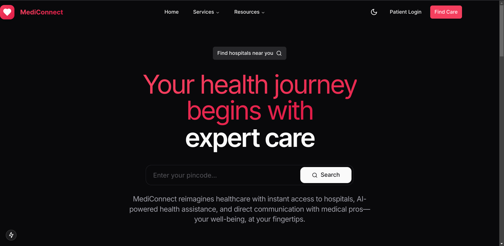

# MediConnect

**AI-powered healthcare platform transforming patient care with personalized insights, secure data management, and 24/7 support—making quality healthcare more accessible and efficient.**

---

## **Inspiration**
Healthcare faces significant challenges: overwhelmed doctors, long wait times, and fragmented systems that fail patients. We created **MediConnect** to bridge these gaps, leveraging technology to provide better access and seamless care for patients and providers alike.

---

## **What It Does**
**MediConnect** serves as an integrated healthcare hub:
- Personalized AI-driven health recommendations.
- Centralized management of medical records and appointments.
- Secure, real-time communication with healthcare teams.
- Real-time tracking of health progress through actionable insights.
- 24/7 access to support services.
- A connected community of healthcare providers.

---

## **How We Built It**
We integrated cutting-edge technologies to create MediConnect:
- **Next.js 15** and **React 19** for a high-performance interface.
- **TypeScript** for robust, scalable development.
- **Tailwind CSS** for intuitive, user-friendly designs.
- **Google AI** for personalized health insights.
- **Supabase** for secure data management.
- Accessibility-focused UI components to ensure inclusivity.

---

## **Challenges We Faced**
Building a comprehensive healthcare platform came with hurdles:
- Balancing user-friendliness with HIPAA compliance.
- Integrating AI assistance while retaining human touchpoints.
- Ensuring stringent security for sensitive medical data.
- Creating a platform adaptable for small clinics and large hospitals.
- Designing an interface that resonates with both patients and providers.

---

## **Key Accomplishments**
We are proud of our achievements:
- A secure, HIPAA-compliant healthcare platform.
- Seamless AI integration alongside healthcare professionals.
- Simplified user experience accessible to all.
- Real-time connection between patients and providers.
- A solution that addresses long-standing inefficiencies in healthcare.

---

## **Lessons Learned**
Our journey brought valuable insights:
- Healthcare security demands unparalleled attention.
- AI enhances, not replaces, human care.
- Thoughtful design significantly improves healthcare experiences.
- Scalability is essential in healthcare technology.
- Technology must amplify the human touch in medicine.

---

## **Future Plans**
We’re excited for what’s next:
- Integration with existing Electronic Health Record (EHR) systems.
- Enhanced AI predictions to optimize health outcomes.
- Mobile applications for improved accessibility.
- Global expansion with multilingual support.
- Integration with wearable health tracking devices.
- Development of specialized tools for diverse medical fields.

---

## **Dataset**
- Comprehensive Medical Q&A Dataset: [Kaggle Dataset](https://www.kaggle.com/datasets/thedevastator/comprehensive-medical-q-a-dataset)

---

## **Demo Credentials**
- **Username:** admin  
- **Password:** admin123
